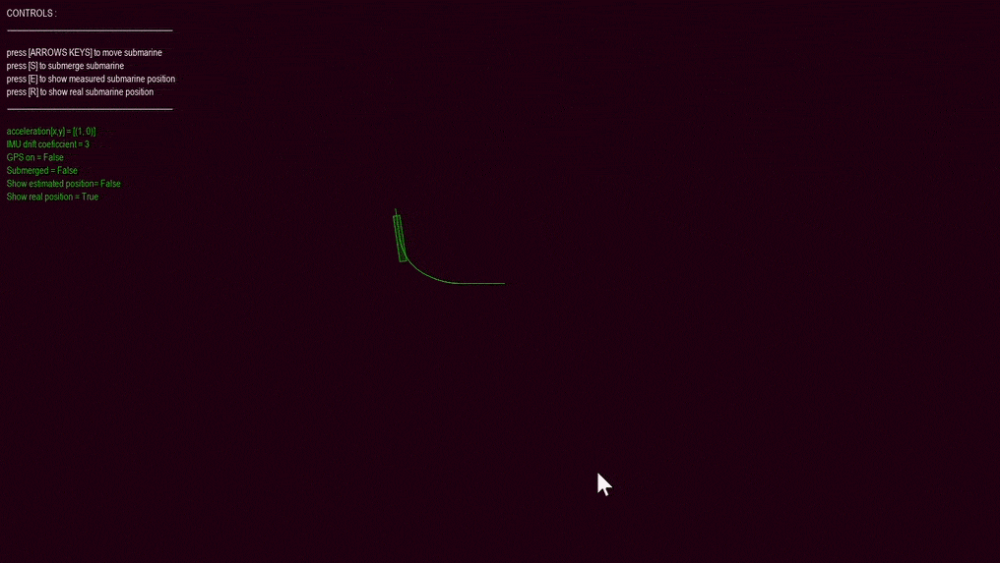
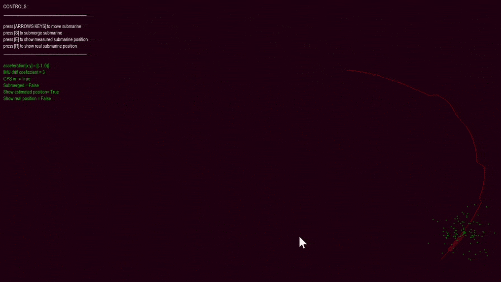

# exercise4

Your assigned exercise is the nr. 4


# Install
The submission was tested on Windows 10 and Ubuntu 20.04 LTS. It should also work other systems (MacOS). It implements a graphical simulation of a submarine using pygame.</br>

**Python version:**
- 3.7

**Modules:**
- pygame
- numpy
- perlin_numpy from github.com/pvigier


**To run this do the following steps:**
1. create a new conda environment *(optional)*
```
conda create -n simulation -y python=3.7
conda activate simulation
```
2. Install dependecies
```
pip install pygame -y
pip install numpy -y
pip3 install git+https://github.com/pvigier/perlin-numpy
```
3. Install win32api for running in Fullscreen *(optional and windows only)*
```
pip install win32api
```
4. Navigate to the folder 
```
cd <path_to_directory>
```

5. Run simulation. With the environment activated run:
```
python sim.py
```
You can set a custom reolution: *(optional)* 
```
python sim.py --resolution 1900x800
```
6. Follow the on-screen menu for the controls. Toggle the menu with ESC
</br>
</br>

# Description of the modules

- `sim.py` is the main simulation file 
- `submarine.py` contains the Submarine class. Two instances of the class are created in the main simulation - for **Ground truth** and **Estimated position** respectively
- `VectorGrid.py` contains the implementation of the flow field and allows vizualization and sampling from the field
- `constants.py` contains various constants which determine the physics and the appearence of the simulation
- `GUI.py` contains functions for the graphical user interface 


# Demo
**This is a demo above water**
- the green submarine is the actual position
- the red submarine is the estimated position
- the dots represent GPS readings
- the big dot is the mean of all readings
- while above water the estimate is updated with every GPS reading</br></br></br>



</br></br>
**This is a demo bellow water**
- here an IMU is simulated with an added random drift
- while underwater the submarine doesn't recieve GPS corrections and the drift becomes more apparent</br></br>

